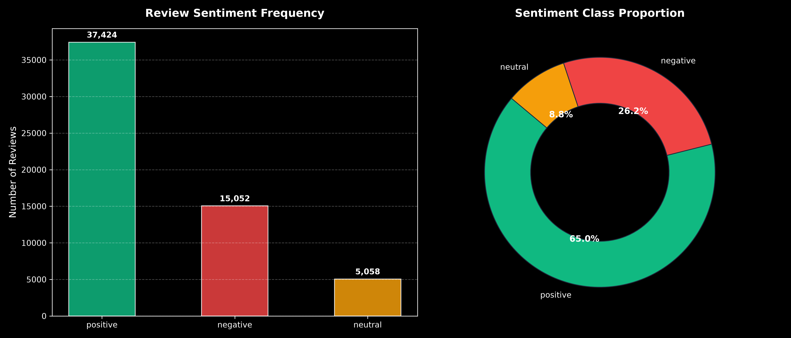
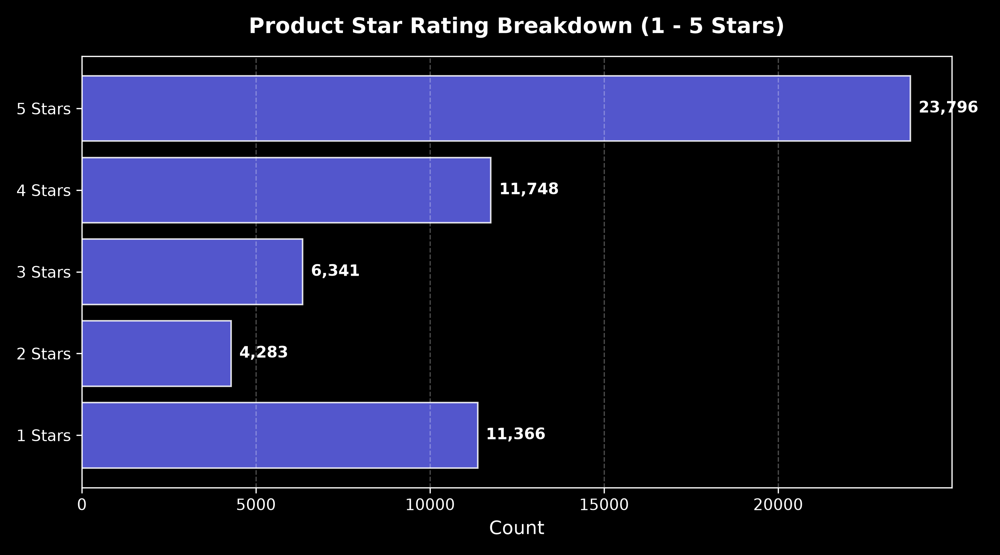
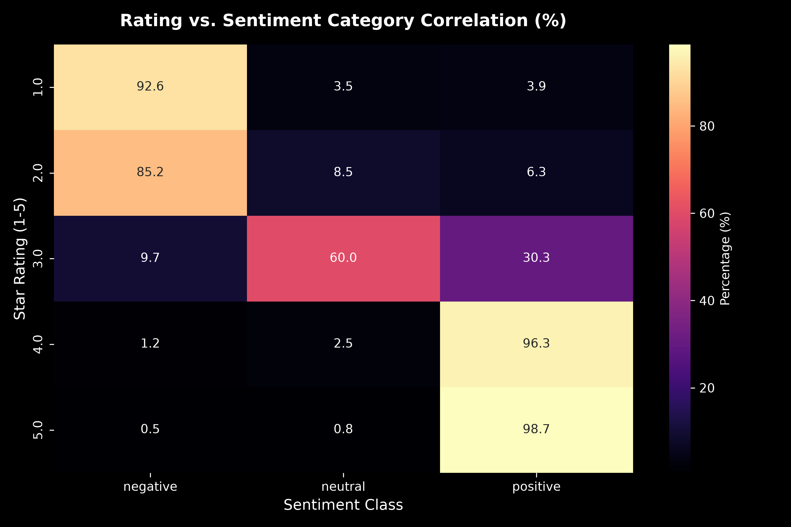
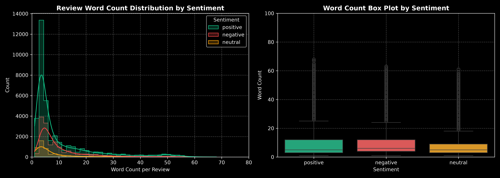
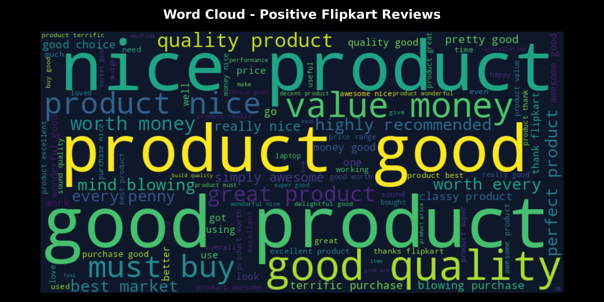
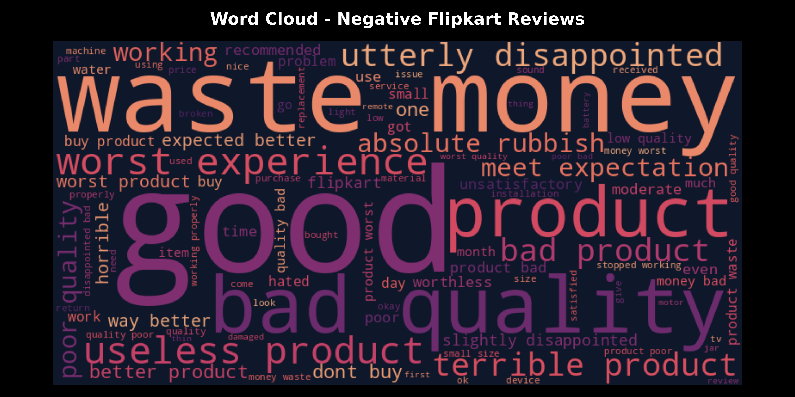

# Flipkart Sentiment Analysis - Exploratory Data Analysis (EDA) Report

## 1. Executive Summary
- **Total Processed Records**: `57,534`
- **Average Customer Rating**: `3.56 / 5.0`
- **Average Review Length**: `10.0 words` (`90.8 characters`)

---

## 2. Sentiment Class Breakdown
| Sentiment | Count | Percentage |
| :--- | :--- | :--- |
| **Positive** | 37,424 | 65.0% |
| **Negative** | 15,052 | 26.2% |
| **Neutral** | 5,058 | 8.8% |

---

## 3. Product Star Rating Analysis
| Star Rating | Review Count | Percentage |
| :--- | :--- | :--- |
| **1 Stars** | 11,366 | 19.8% |
| **2 Stars** | 4,283 | 7.4% |
| **3 Stars** | 6,341 | 11.0% |
| **4 Stars** | 11,748 | 20.4% |
| **5 Stars** | 23,796 | 41.4% |

---

## 4. Rating vs Sentiment Correlation

---

## 5. Review Length & Text Distribution

---

## 6. Word Clouds & Frequent Key Terms

### Positive Reviews Key Terms

### Negative Reviews Key Terms

---

## 7. Key Findings & Insights
1. **Dominant Class**: Positive reviews constitute the majority of the Flipkart dataset, aligned with 4-star and 5-star customer ratings.
2. **Negative Review Indicators**: Terms such as *bad*, *worst*, *defect*, *fan*, *noise*, and *useless* appear heavily in 1-star and 2-star reviews.
3. **Data Quality**: The text cleaning pipeline successfully removed special unicode noise (such as `??????`), numbers, and stopwords, creating high-signal normalized text for machine learning.
